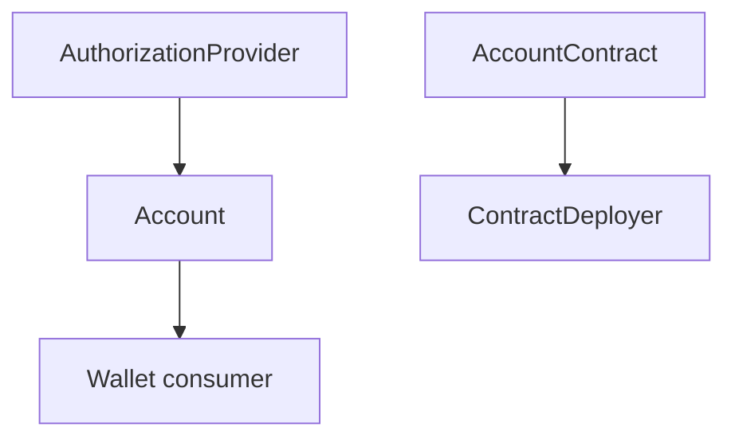

# Account Layer

`aztec-account` implements Aztec's account abstraction: the traits, concrete flavors, entrypoints, authorization, and deployment helpers.

## Context

On Aztec every account is a contract.
The client side needs to:

- Wrap user-authored calls in that contract's entrypoint (adding auth + fee metadata).
- Produce authorization witnesses.
- Deploy new accounts, including the bootstrap case where the account pays for its own deployment.

## Design

Three-layer trait model:

- `AuthorizationProvider` — produces signatures / authwits.
- `Account` — composes auth + entrypoint + address; the user-facing abstraction.
- `AccountContract` — the on-chain side: the deployable contract that validates entrypoint calls.

The [`AccountProvider`](../reference/aztec-wallet.md) trait in `aztec-wallet` is the bridge between accounts and the wallet; `SingleAccountProvider` adapts one `Account` to satisfy it.

## Implementation

### Flavors

- **Schnorr** — `SchnorrAccount`, `SchnorrAccountContract`, `SchnorrAuthorizationProvider`.
  Default production flavor; Grumpkin Schnorr signatures.
- **Signerless** — `SignerlessAccount`.
  No authentication; used for deployment bootstrap (the first tx of a fresh account) and for tests.

ECDSA flavors are not shipped from this crate yet.

### Entrypoints

- `DefaultAccountEntrypoint` — single-call entrypoint used by most account contracts.
- `DefaultMultiCallEntrypoint` — batches calls into one tx.
- `EncodedAppEntrypointCalls` — the field-encoded call array produced by either entrypoint.
- `AccountFeePaymentMethodOptions` — the shape carried through the entrypoint for fee payment.

`meta_payment::AccountEntrypointMetaPaymentMethod` is a `FeePaymentMethod` implementation that reuses the account's own entrypoint for the payment call, avoiding a separate public fee call.

### `AccountManager`

`AccountManager<W>` is the high-level helper that ties it all together:

- Registers the account into the PXE.
- Computes the deterministic account address.
- Drives `DeployAccountMethod` → `DeployResult`.

It is generic over `W: Wallet`, so it works with either a real `BaseWallet` or a `MockWallet` for tests.

### Deployment Bootstrap

A brand-new account can't authorize its own deployment (no signing key on-chain yet), so the flow uses `SignerlessAccount` for the first tx while a claim-based fee strategy handles funding.

## Edge Cases

- **Double registration**: `register_account` on an already-known account is a no-op.
- **Wrong nonce / auth**: simulation fails with an `Error::Abi` or `Error::Reverted` depending on where validation triggers; callers SHOULD surface the underlying message.
- **Fee self-pay**: deploying an account while paying from that same account requires a strategy that doesn't presume prior deployment — typically `FeeJuicePaymentMethodWithClaim` or `SponsoredFeePaymentMethod`.

## Security Considerations

- Signing keys are held by the `AuthorizationProvider` — it is the cryptographic boundary of the account.
- Entrypoint contracts MUST validate nonces and signatures; incorrect implementations permit replay.
- A `SignerlessAccount` is an unauthenticated account by definition; never use it outside of bootstrap / tests.

## References

- [`aztec-account` reference](../reference/aztec-account.md)
- [`aztec-wallet` reference](../reference/aztec-wallet.md) — `AccountProvider` + `BaseWallet`.
- [Concepts: Accounts & Wallets](../concepts/accounts-and-wallets.md)
