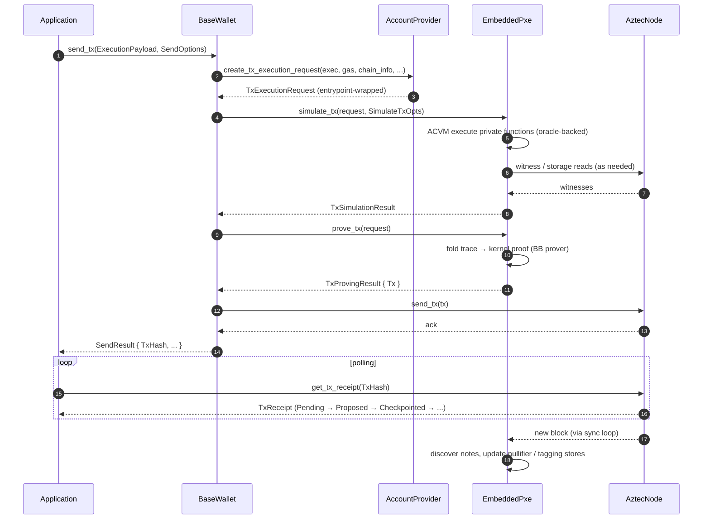
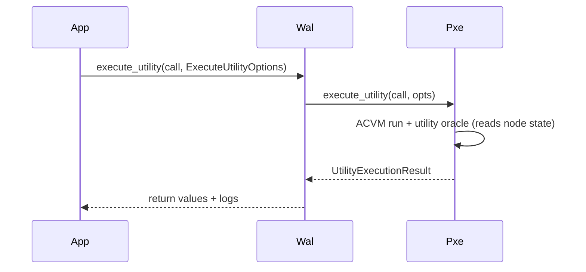
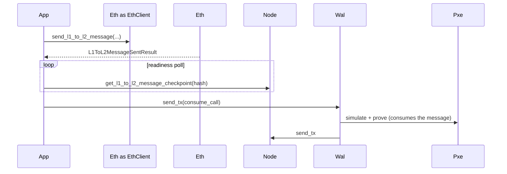

# Data Flow

How a transaction moves through `aztec-rs` from application code to on-chain inclusion and back.

## Private-Call Transaction

Key control points:

- The wallet is the only caller of `AccountProvider` — account knowledge is isolated.
- Simulation and proving both live inside the PXE.
- The node never sees private inputs; only the wire-format `Tx` with client proof.
- Sync runs continuously in the background; new notes become available without an explicit fetch.

## Public-Only Transaction

Same shape, but `simulate_tx` does no private ACVM work — the wallet just builds the public call list, sends it, and the sequencer runs the public execution.

## Utility Call (Off-Chain)

Utility calls never produce a transaction or a receipt.

## Cross-Chain (L1 → L2)

See [Ethereum Layer](./ethereum-layer.md) for the opposite direction (L2 → L1).

## References

- [PXE Runtime](./pxe-runtime.md)
- [Wallet Layer](./wallet-layer.md)
- [Ethereum Layer](./ethereum-layer.md)
