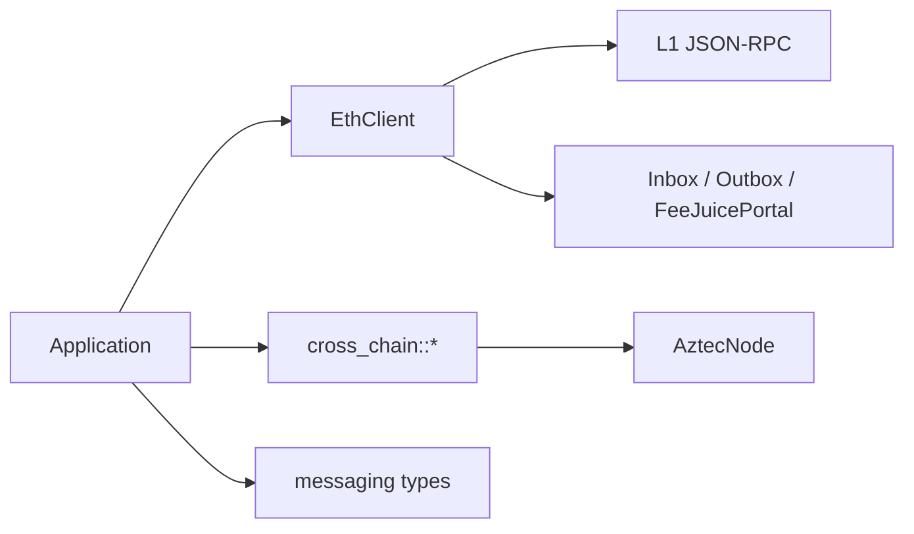

# Ethereum Layer

`aztec-ethereum` is the client-side half of Aztec's L1 / L2 boundary: L1 JSON-RPC client, Inbox/Outbox interactions, Fee Juice bridge, and cross-chain readiness polling.

## Context

Aztec's bridge story has three shapes:

1. **L1 → L2 messaging** — an L1 tx publishes a message; L2 consumes it after inclusion.
2. **L2 → L1 messaging** — an L2 tx emits; L1 consumes after finality.
3. **Fee Juice bridge** — the canonical L1 → L2 flow for funding accounts.

All of these need both an L1 transaction client and awareness of the L2 archiver's view of L1 messages.

## Design

- `messaging` — pure data types (`L1Actor`, `L2Actor`, `L1ToL2Message`, `L2Claim`, `L2AmountClaim`, `L2AmountClaimWithRecipient`, `generate_claim_secret`).
- `l1_client` — the `EthClient`, portal interactions, `FeeJuicePortal` bridge.
- `cross_chain` — node-side readiness probes built on `AztecNode::get_l1_to_l2_message_checkpoint`.

## Implementation

### `EthClient`

A small JSON-RPC client:

- `rpc_call(method, params)` — raw call.
- `get_account` — returns the first account (useful in test harnesses).
- `send_transaction(...)` / `wait_for_receipt(tx_hash)`.

It uses `aztec-rpc`'s `RpcTransport` for HTTP.

### `L1ContractAddresses`

The bag of deployed L1 portal / rollup contract addresses, reconstructed from the Aztec node's `NodeInfo` via `L1ContractAddresses::from_json(...)`.

### `send_l1_to_l2_message`

Composes an L1 tx against the Inbox for an `L1ToL2Message`, returning `L1ToL2MessageSentResult` with:

- The L1 tx hash.
- The on-L2 message hash + leaf index needed for later consumption.

### Fee Juice Bridge

`prepare_fee_juice_on_l1(eth, l1_addresses, recipient, amount)` wraps the approve → deposit → message flow into a single helper, returning `FeeJuiceBridgeResult` with the `L2AmountClaim` ready for use with `FeeJuicePaymentMethodWithClaim` in [`aztec-fee`](../reference/aztec-fee.md).

### Readiness

- `is_l1_to_l2_message_ready(&node, &hash)` — single-shot predicate.
- `wait_for_l1_to_l2_message_ready(&node, &hash, timeout)` — blocks until ready or times out.

Both delegate to `AztecNode::get_l1_to_l2_message_checkpoint` under the hood.

## Edge Cases

- **L1 reorgs** — readiness is advisory until the L1 tx reaches the archiver's confirmation depth; applications that care about finality SHOULD wait for proven before acting on the L2 side.
- **Duplicate claims** — claim consumption is one-shot; attempting the same claim twice will revert the second tx at simulation time.
- **Missing L1 addresses** — `L1ContractAddresses::from_json` returns `None` if `NodeInfo` lacks the L1 section; callers should surface a clearer error.

## Security Considerations

- Cross-chain messages MUST bind sender, recipient, content, and secret hash; tampering with any field produces a different message hash and fails consumption.
- L2-side consumption MUST verify inclusion against the correct tree root from the L2 archiver view; do not trust L1 contract state alone.
- L1 private keys are out of scope for this crate — you bring your own signer via `EthClient::send_transaction`'s arguments.

## References

- [`aztec-ethereum` reference](../reference/aztec-ethereum.md)
- [`aztec-fee` reference](../reference/aztec-fee.md) — consumes `L2AmountClaim`.
- [Concepts: Cross-Chain Messaging](../concepts/cross-chain-messaging.md)
