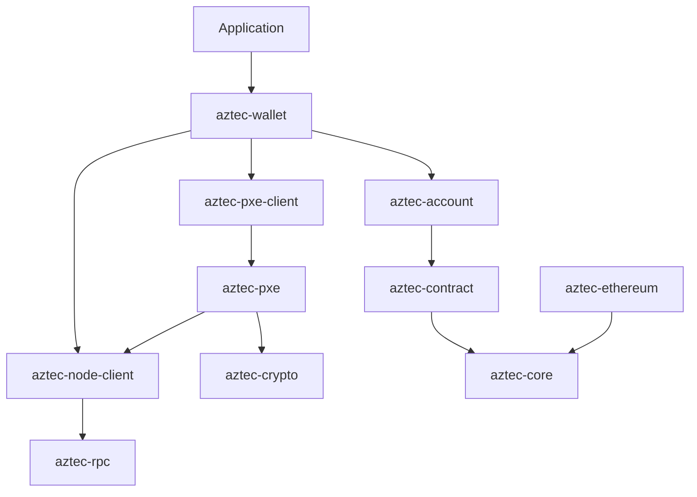

# System Overview

Architectural map of `aztec-rs` and how the crates fit together.

## High-Level Diagram

## Responsibility Boundaries

| Boundary          | Crate(s)                                                     |
| ----------------- | ------------------------------------------------------------ |
| Transport         | `aztec-rpc`, `aztec-node-client`, `aztec-ethereum`           |
| Runtime           | `aztec-pxe`, `aztec-pxe-client`                              |
| User-facing APIs  | `aztec-wallet`, `aztec-account`, `aztec-contract`, `aztec-fee` |
| Primitives        | `aztec-core`, `aztec-crypto`                                 |
| Umbrella          | `aztec-rs`                                                   |

## References

- [Workspace Layout](./workspace-layout.md)
- [Data Flow](./data-flow.md)
