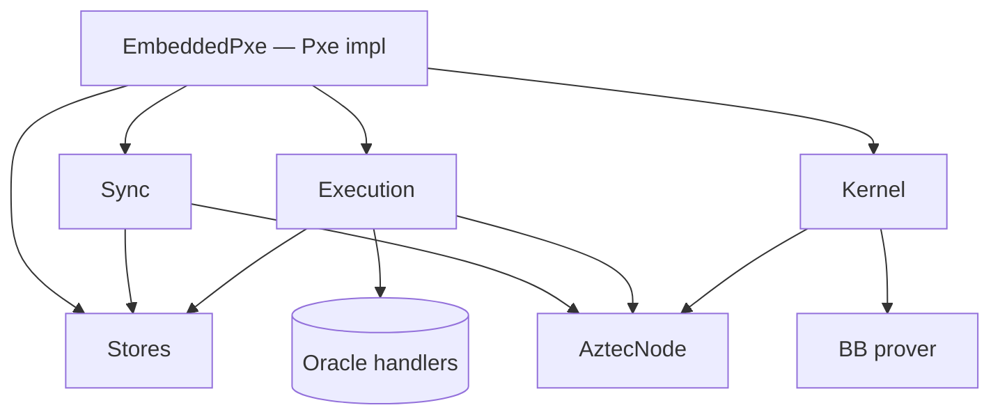

# PXE Runtime

Internal architecture of the embedded PXE shipped as [`aztec-pxe`](../reference/aztec-pxe.md).

## Context

Aztec's privacy model requires private-function execution to happen on the user's machine, where secret keys and notes live.
The embedded PXE is a complete implementation of the [`Pxe` trait](../reference/aztec-pxe-client.md) — no separate PXE server is needed in the Aztec v4.x client-side model.

## Design

The runtime is split into four cooperating subsystems plus a composition root:

### Stores (`stores/`)

All state sits behind a `KvStore` trait.
Two implementations ship:

- `InMemoryKvStore` — ephemeral, fast, ideal for tests.
- `SledKvStore` — persistent via [sled], suitable for long-running apps.

Typed facades built on top:

- `ContractStore` — artifacts + registered instances.
- `KeyStore`, `AddressStore` — account keys + complete addresses.
- `NoteStore`, `PrivateEventStore` — decrypted private state.
- `CapsuleStore` — contract-provided side data.
- `SenderStore`, `SenderTaggingStore`, `RecipientTaggingStore` — tagging bookkeeping for note discovery.
- `AnchorBlockStore` — last-synced block header.

### Execution (`execution/`)

Runs private functions via the ACVM:

- `acvm_executor.rs` — drives the virtual machine.
- `oracle.rs` / `utility_oracle.rs` — answer oracle calls with PXE-owned state (notes, capsules, storage witnesses fetched from the node).
- `pick_notes.rs` — note selection for functions that consume notes.
- `field_conversion.rs` — boundary conversions between ABI, ACVM, and protocol field types.
- `execution_result.rs` — the structured trace produced for the kernel.

### Kernel (`kernel/`)

Folds execution traces into the private kernel circuit and proves them:

- `SimulatedKernel` — simulation-only path (no proof), used by `simulate_tx`.
- `BbPrivateKernelProver` + `BbProverConfig` — real proving via barretenberg.
- `PrivateKernelProver` / `PrivateKernelExecutionProver` — the orchestrating interfaces.
- `ChonkProofWithPublicInputs` — the final client proof carried on the wire.

### Sync (`sync/`)

Background block follower and note discovery:

- `BlockStateSynchronizer` + `BlockSyncConfig` — block pulling + fan-out.
- `ContractSyncService` — artifact + instance metadata updates.
- `LogService` / `NoteService` / `EventService` — log routing.
- `PrivateEventFilterValidator` — validates `PrivateEventFilter` inputs for `get_private_events`.

## Implementation

Composition lives in `embedded_pxe.rs`.
Construction paths:

- `create_ephemeral(node)` — in-memory KV, default config.
- `create(node, kv)` — user-provided KV store.
- `create_with_config(node, kv, config)` / `create_with_prover_config(...)` — full control.

The runtime is generic over its `AztecNode` so alternate node backends (mocks, caching proxies) can be slotted in.

## Edge Cases

- **Node disconnects mid-sync** — the sync loop retries with backoff; application-level readiness is governed by `wait_for_node` / `wait_for_tx` in `aztec-node-client`.
- **Chain re-orgs** — nullifiers and notes are rewound to the new anchor block; stores maintain the invariant via `AnchorBlockStore`.
- **Missing artifacts** — simulation fails fast with an `Abi` or `InvalidData` error; register the artifact before retrying.
- **Dropped receipts** — `WaitOpts::ignore_dropped_receipts_for` (default 5 s) absorbs mempool/inclusion races.

## Security Considerations

- Secret keys live in `KeyStore`; they MUST NOT leave the PXE process.
- Oracle responses are trusted *inside* the ACVM but constrained by kernel circuits; unvalidated data MUST NOT short-circuit kernel checks.
- Persistent stores (`SledKvStore`) SHOULD be treated as sensitive at rest — notes and keys are stored in plaintext on disk.

## References

- [`aztec-pxe` reference](../reference/aztec-pxe.md)
- [`aztec-pxe-client` reference](../reference/aztec-pxe-client.md)
- [Data Flow](./data-flow.md)

[sled]: https://docs.rs/sled
