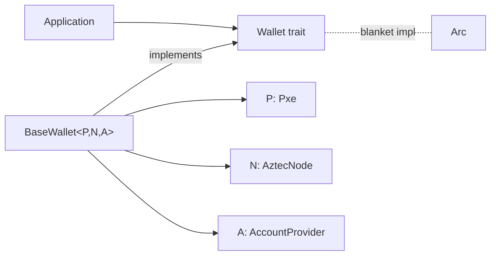

# Wallet Layer

`aztec-wallet` is the composition root where the PXE, node client, and account provider meet to produce a single `Wallet` surface.

## Context

Applications want one object they can use to:

- Introspect accounts and chain state.
- Simulate, profile, send, and wait on transactions.
- Read private events and public storage.

Those operations touch three different subsystems.
The wallet layer unifies them under the [`Wallet` trait](../reference/aztec-wallet.md).

## Design

- `Wallet` is the user-facing trait — application code depends on this.
- `BaseWallet<P, N, A>` is the default production implementation, generic over the three backends.
- `Arc<W>` implements `Wallet` via a blanket impl, so a single wallet can be shared across async tasks cheaply.
- `AccountProvider` isolates account logic, letting alternate signer backends (CLI, browser extension) plug into the same wallet.

## Implementation

Key files:

- `base_wallet.rs` — the composition root and `Wallet` impl; `create_wallet`, `create_embedded_wallet`.
- `account_provider.rs` — `AccountProvider` trait (transaction request construction, auth witnesses, complete-address lookup).
- `wallet.rs` — `Wallet` trait + option/result types + `MockWallet` for tests.

### Transaction Submission Path

1. App calls `send_tx(exec, SendOptions)`.
2. Wallet asks `AccountProvider::create_tx_execution_request` to wrap the payload in the account's entrypoint (authenticating and adding fee-payment hooks).
3. Wallet asks the PXE to simulate, then prove, then hands the resulting `Tx` to the node.
4. The returned `SendResult` carries the `TxHash` and hooks for `wait_for_tx_proven`.

### Contract Registration

`register_contract` persists a `ContractInstanceWithAddress` + optional artifact + optional note-decryption secret into PXE stores so the wallet can simulate and decrypt events for that contract.

### Utility Calls

`execute_utility` bypasses the transaction path entirely — the PXE runs the utility function locally and returns the decoded values.

## Edge Cases

- **Arc sharing**: `Arc<BaseWallet<...>>` is `Wallet`; avoid constructing two `BaseWallet`s pointing at the same PXE, or you'll duplicate background sync work.
- **Account missing in provider**: methods that need the account's keys (e.g. `create_auth_wit`) return `Error::InvalidData` rather than panicking.
- **`wait_for_contract`**: polls the node until the deployed instance is queryable — necessary because deployment is only observable after the block is proposed.

## Security Considerations

- `AccountProvider` is the only component that holds signing material; swapping providers is the correct way to switch signer backends without touching wallet logic.
- `SendOptions::fee` chooses the fee payment method; the wallet merges the resulting payload with user calls before the provider wraps the entrypoint. A mis-chosen method is rejected at simulation time, not inclusion time.

## References

- [`aztec-wallet` reference](../reference/aztec-wallet.md)
- [`aztec-account` reference](../reference/aztec-account.md) — concrete `AccountProvider` implementations.
- [Data Flow](./data-flow.md)
