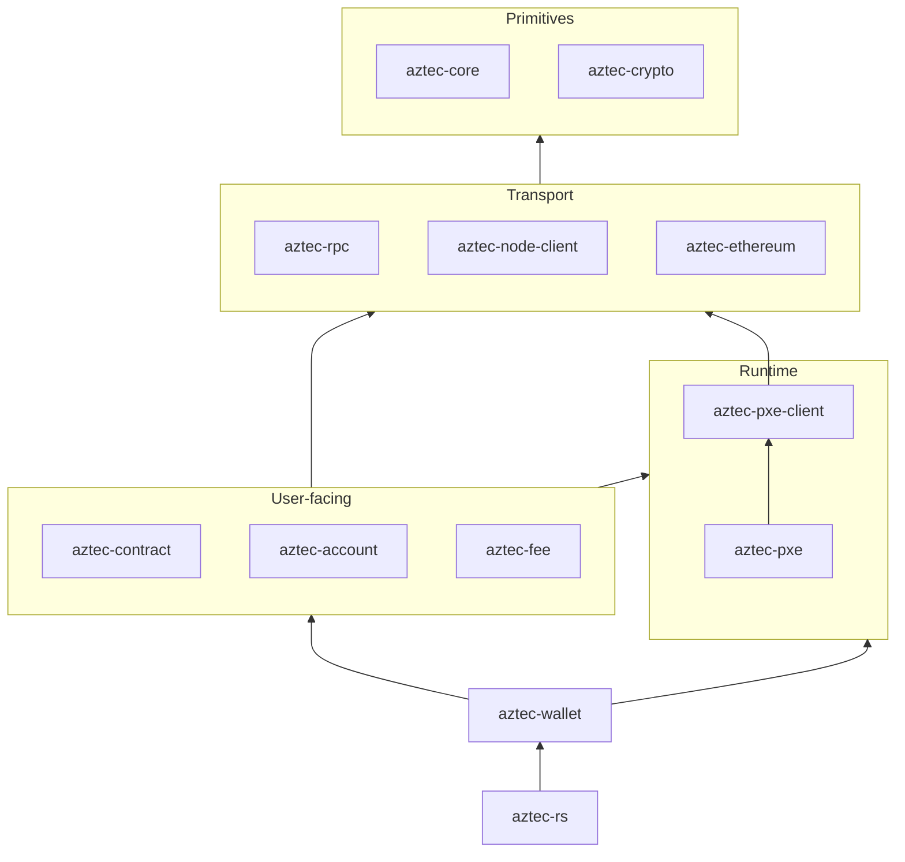

# Workspace Layout

`aztec-rs` is a Cargo workspace. The root `Cargo.toml` declares members under `crates/` and re-exports them via the umbrella `aztec-rs` crate.

## Directory Tree

```
aztec-rs/
├─ Cargo.toml              # workspace + umbrella crate
├─ src/                    # umbrella re-exports
├─ crates/
│  ├─ core/                # primitives, ABI, errors, tx, validation
│  ├─ rpc/                 # JSON-RPC transport
│  ├─ crypto/              # BN254, Grumpkin, Poseidon2, Schnorr, keys
│  ├─ node-client/         # Aztec node HTTP client + polling
│  ├─ pxe-client/          # PXE trait + shared types
│  ├─ pxe/                 # embedded PXE runtime
│  ├─ wallet/              # BaseWallet + account provider glue
│  ├─ contract/            # contract handles, deployer, events, authwits
│  ├─ account/             # account flavors, entrypoints, deployment
│  ├─ fee/                 # fee payment strategies
│  └─ ethereum/            # L1 client + cross-chain messaging
├─ examples/               # runnable end-to-end samples
├─ fixtures/               # compiled contract artifacts for tests/examples
└─ tests/                  # E2E integration tests
```

## Dependency Layering

Higher layers depend on lower ones; there are no cycles.



## References

- [System Overview](./overview.md)
- [Crate Index](../reference/crates.md)
