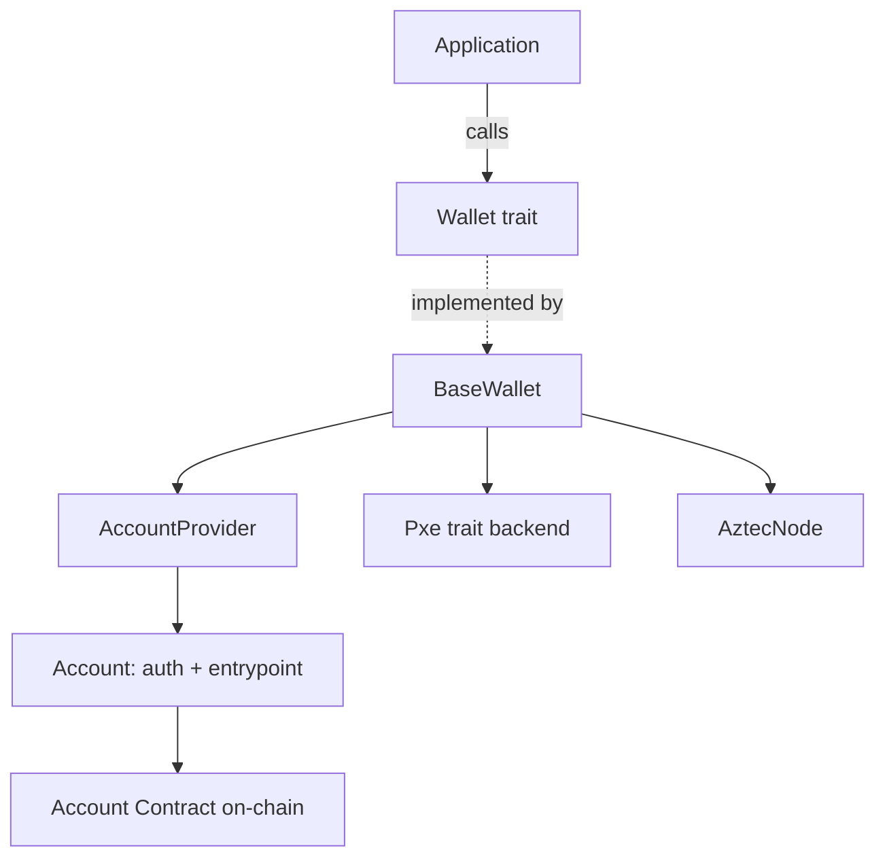

# Accounts & Wallets

Aztec uses account abstraction: every account is itself a contract, and a **wallet** composes a PXE, a node client, and an **account provider** to produce authenticated transactions.

## Context

There is no "externally owned account" on Aztec.
Accounts are deployed as contracts and authorize transactions through an entrypoint function.

## Design

`aztec-rs` separates concerns cleanly:

- [`aztec-account`](../reference/aztec-account.md) — account flavors, entrypoints, deployment helpers.
- [`aztec-wallet`](../reference/aztec-wallet.md) — `BaseWallet` composes PXE + node + account provider.
- [`aztec-pxe-client`](../reference/aztec-pxe-client.md) — the PXE trait consumed by the wallet.

The wallet never knows about signing keys directly — it delegates to the `AccountProvider`, which owns them.
Swapping signers (embedded keys → CLI signer → browser extension) means swapping the provider.

Shipped account flavors in [`aztec-account`](../reference/aztec-account.md):

- **Schnorr** — default production flavor (Grumpkin Schnorr).
- **Signerless** — for deployment bootstrap and tests.

ECDSA flavors exist in the broader Aztec ecosystem but are not currently shipped from this crate.

## Implementation

- Account contracts are loaded from compiled artifacts under `fixtures/`.
- Deployment goes through [`aztec-contract`](../reference/aztec-contract.md)'s deployer.
- Entrypoint calls are built by the account layer and submitted by the wallet.

## Edge Cases

- Deploying an account that pays for its own deployment — requires a fee strategy that does not depend on an already-deployed account. See [Fees](./fees.md).
- Authorizing calls on behalf of another account — see authwit flows in [`aztec-contract`](../reference/aztec-contract.md).

## Security Considerations

- The account provider owns signing keys; treat it as a cryptographic boundary.
- Entrypoint constraints MUST validate nonces and authorization to prevent replay.

## References

- [Guide: Account Lifecycle](../guides/account-lifecycle.md)
- [Architecture: Wallet Layer](../architecture/wallet-layer.md)
- [Architecture: Account Layer](../architecture/account-layer.md)
