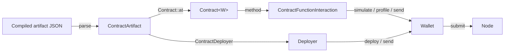

# Contracts

An Aztec contract bundles **private**, **public**, and **utility** functions behind a single address.
`aztec-rs` loads compiled contract artifacts and exposes typed interaction surfaces.

## Context

Contract compilation is handled by the Noir/Aztec toolchain and produces a JSON artifact
(see `fixtures/*.json`).
`aztec-rs` consumes those artifacts at runtime — it does not compile Noir.

## Design

- **Artifact loading** — parse the JSON, validate ABI shape, and derive class identifiers.
- **Deployment** — builder pattern for class registration + instance publication, with deterministic addressing.
- **Interaction** — typed call builders for private, public, and utility functions.
- **Events** — filter + decode private and public events from sync state.

## Implementation

See [`aztec-contract`](../reference/aztec-contract.md) and [`aztec-core`](../reference/aztec-core.md)'s ABI module.

## Edge Cases

- Utility functions MUST NOT be scheduled as on-chain calls — they return values locally.
- Calls that span private → public MUST produce the correct enqueued call shape for the sequencer.

## Security Considerations

- Artifact integrity should be verified against the expected class hash before use.
- Public function return values come from untrusted node state; treat them accordingly.

## References

- [Guide: Deploying Contracts](../guides/deploying-contracts.md)
- [Guide: Calling Contracts](../guides/calling-contracts.md)
- [Architecture: Contract Layer](../architecture/contract-layer.md)
