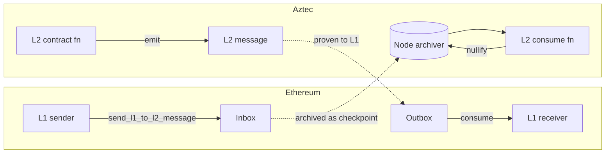

# Cross-Chain Messaging

Aztec exchanges messages with Ethereum (L1) in both directions.
`aztec-rs` provides L1-to-L2 send helpers, readiness polling, and L2-to-L1 consumption flows.

## Context

Bridges, token portals, and Fee Juice deposits all rely on cross-chain messaging.
An L1 transaction publishes a message that becomes consumable on L2 after inclusion, and vice versa.

## Design

- **L1 → L2** — send via the L1 Inbox contract, wait for inclusion, consume inside a private/public call.
- **L2 → L1** — emit from L2, wait for finality, verify and consume on L1 via the Outbox.
- **Readiness polling** — helpers block until a message is consumable on the destination chain.

## Implementation

See [`aztec-ethereum`](../reference/aztec-ethereum.md) for L1-side helpers and
[`aztec-core`](../reference/aztec-core.md) for message hashing + tree structures.

## Edge Cases

- A message not yet included on the destination MUST return a pending status, not an error.
- Consumption MUST verify inclusion against the correct tree root and sibling path.

## Security Considerations

- Cross-chain messages MUST bind sender, recipient, and content; never trust content alone.
- Replay protection is enforced by the destination's consumption proof.

## References

- [Guide: Cross-Chain Messaging](../guides/cross-chain-messaging.md)
- [Architecture: Ethereum Layer](../architecture/ethereum-layer.md)
