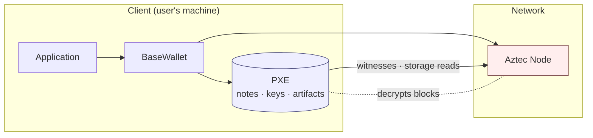

# PXE: Private Execution Environment

The PXE is the client-side runtime that executes private functions and holds user secrets.
`aztec-rs` ships an in-process implementation in the [`aztec-pxe`](../reference/aztec-pxe.md) crate.

## Context

Aztec's privacy model requires that private function execution happen on the user's machine,
where secret keys and notes live.
Public data is fetched from the node; private data never leaves the PXE.

## Design

A PXE implementation exposes the [`Pxe`](../reference/aztec-pxe-client.md) trait defined in `aztec-pxe-client`.
Wallets and applications depend on the trait, not on a concrete runtime, so alternate backends
(remote RPC PXE, mocks for tests) can be plugged in.

Private data stays inside the blue box.
The red box is untrusted; it only sees the wire-format `Tx` (with client proof) and the public reads the PXE explicitly requests.

Core responsibilities:

- **Local stores** — contract artifacts, notes, capsules, tagging state, address bookkeeping.
- **Execution** — deterministic ACVM-based private function execution with oracle access.
- **Kernel simulation & proving** — private kernel circuits validate the execution trace.
- **Block sync** — note discovery, tagging, and nullifier tracking as new blocks arrive.

## Implementation

The embedded PXE lives under `crates/pxe/src/` with modules:

- `stores/` — persistent and in-memory stores.
- `execution/` — ACVM host, oracle handlers, and tx execution orchestration.
- `kernel/` — kernel circuit inputs and proving glue.
- `sync/` — note discovery and block follower.
- `embedded_pxe.rs` — composition root implementing the `Pxe` trait.

## Edge Cases

- Node disconnects mid-sync — see [Node Client](../architecture/node-client.md) for retry semantics.
- Re-orgs and rollbacks — notes and nullifiers rewind to the last finalized block.
- Missing contract artifacts — private calls fail fast with a typed error.

## Security Considerations

- Secret keys are held by the PXE's key store; never transmit them.
- Oracle responses must be validated against kernel constraints.
- Persistent stores should be treated as sensitive at rest.

## References

- [`aztec-pxe` reference](../reference/aztec-pxe.md)
- [`aztec-pxe-client` reference](../reference/aztec-pxe-client.md)
- [Architecture: PXE Runtime](../architecture/pxe-runtime.md)
